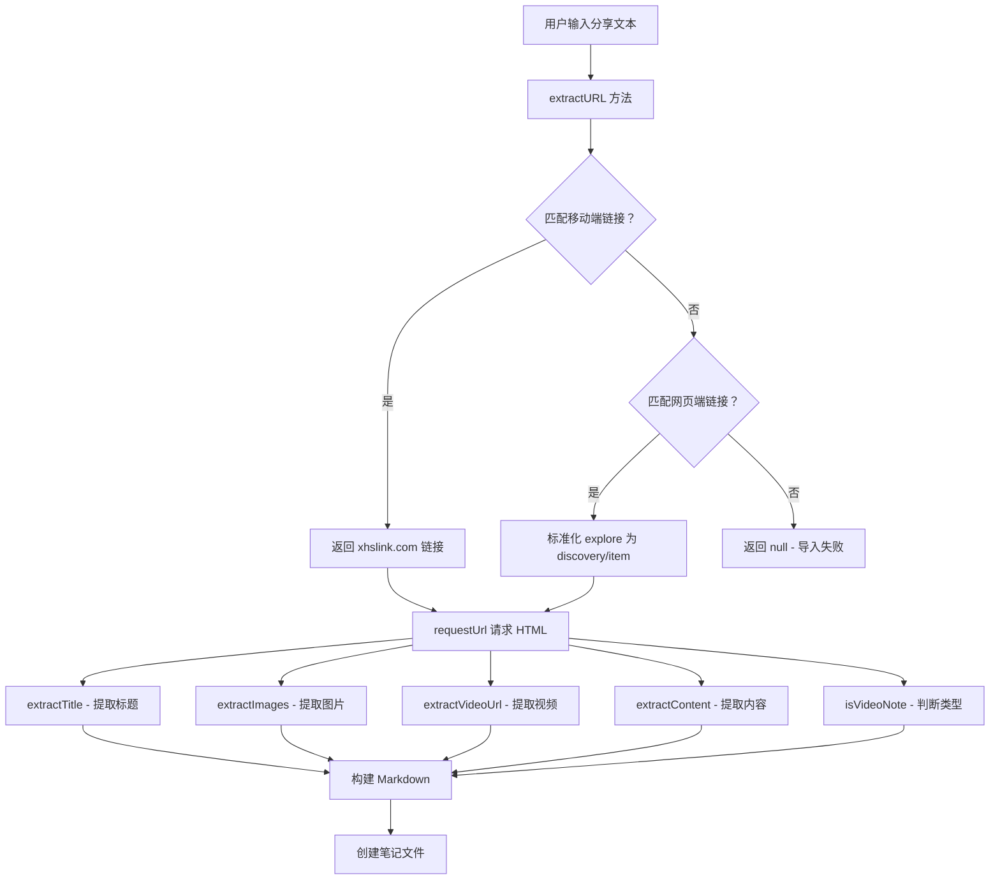

# URL 提取与解析逻辑详解

## 📖 概述

本文档深入分析 Xiaohongshu Importer 插件中 URL 提取、HTML 解析和数据提取的完整流程。这是插件的核心功能，决定了能否成功导入小红书笔记。

---

## 🔄 完整流程图



---

## 1️⃣ URL 提取逻辑 (`extractURL`)

### 代码位置
[`main.ts:L76-L92`](file:///d:/work/code/study_code/xiaohongshu-importer/main.ts#L76-L92)

### 完整代码
```typescript
extractURL(shareText: string): string | null {
    // First try to match mobile share links
    const mobileUrlMatch = shareText.match(/http:\/\/xhslink\.com\/a?o?\/[^\s,，]+/);
    if (mobileUrlMatch) {
            return mobileUrlMatch[0];
    }
    
    // Then try to match desktop/web links (both discovery/item and explore formats)
    const webUrlMatch = shareText.match(/https:\/\/www\.xiaohongshu\.com\/(?:discovery\/item|explore)\/[a-zA-Z0-9]+(?:\?[^\s,，]*)?/);
    if (webUrlMatch) {
        // Normalize explore URLs to discovery/item format
        return webUrlMatch[0].replace('/explore/', '/discovery/item/');
    }
    
    return null;
}
```

### 详细分析

#### 1.1 移动端链接匹配

**正则表达式**: `/http:\/\/xhslink\.com\/a?o?\/[^\s,，]+/`

**分解说明**:
| 部分 | 含义 | 示例 |
|------|------|------|
| `http:\/\/` | 匹配 `http://`（注意未支持 https） | `http://` |
| `xhslink\.com\/` | 匹配域名 | `xhslink.com/` |
| `a?o?\/` | 匹配可选的 `a` 和 `o` 字符 | `/`, `/a/`, `/o/`, `/ao/` |
| `[^\s,，]+` | 匹配一个或多个非空白、非逗号字符 | `ABC123xyz` |

**支持的链接格式**:
```
http://xhslink.com/ABC123
http://xhslink.com/a/ABC123
http://xhslink.com/o/ABC123
http://xhslink.com/ao/ABC123
```

**匹配示例**:
```typescript
// 输入
"64 不叫小黄了发布了一篇小红书笔记，快来看看！http://xhslink.com/a/ABC123xyz，复制此行打开小红书"

// 匹配结果
["http://xhslink.com/a/ABC123xyz，"]

// 返回值
"http://xhslink.com/a/ABC123xyz，"  // 注意：包含中文逗号
```

**⚠️ 潜在问题**:
- 正则 `[^\s,，]+` 会匹配到后面的中文逗号，导致 URL 包含多余字符
- 只支持 `http` 不支持 `https`（虽然 xhslink 通常使用 http）

#### 1.2 网页端链接匹配

**正则表达式**: `/https:\/\/www\.xiaohongshu\.com\/(?:discovery\/item|explore)\/[a-zA-Z0-9]+(?:\?[^\s,，]*)?/`

**分解说明**:
| 部分 | 含义 | 示例 |
|------|------|------|
| `https:\/\/` | 匹配 `https://` | `https://` |
| `www\.xiaohongshu\.com\/` | 匹配域名 | `www.xiaohongshu.com/` |
| `(?:discovery\/item|explore)` | 非捕获组，匹配两种路径 | `/discovery/item` 或 `/explore` |
| `\/` | 路径分隔符 | `/` |
| `[a-zA-Z0-9]+` | 匹配笔记 ID（字母数字） | `65a3b2c1d4e5f6` |
| `(?:\?[^\s,，]*)?` | 可选的查询参数 | `?xsec_token=ABC123` |

**支持的链接格式**:
```
https://www.xiaohongshu.com/discovery/item/65a3b2c1d4e5f6
https://www.xiaohongshu.com/explore/65a3b2c1d4e5f6
https://www.xiaohongshu.com/discovery/item/65a3b2c1d4e5f6?xsec_token=ABC123
https://www.xiaohongshu.com/explore/65a3b2c1d4e5f6?xsec_token=ABC123&source=share
```

**匹配示例**:
```typescript
// 输入 1
"快来看看这篇笔记：https://www.xiaohongshu.com/explore/65a3b2c1d4e5f6 很好看"

// 匹配结果
["https://www.xiaohongshu.com/explore/65a3b2c1d4e5f6"]

// 返回值（标准化后）
"https://www.xiaohongshu.com/discovery/item/65a3b2c1d4e5f6"

// 输入 2（带参数）
"https://www.xiaohongshu.com/discovery/item/ABC123?xsec_token=XYZ&source=share"

// 返回值
"https://www.xiaohongshu.com/discovery/item/ABC123?xsec_token=XYZ&source=share"
```

#### 1.3 URL 标准化

**目的**: 将 `explore` 路径统一转换为 `discovery/item` 路径

**实现**:
```typescript
return webUrlMatch[0].replace('/explore/', '/discovery/item/');
```

**原因**:
- 小红书网页版有两种 URL 格式
- `explore` 是较新的格式
- 统一格式便于后续处理和请求

**转换示例**:
```
输入：https://www.xiaohongshu.com/explore/65a3b2c1d4e5f6
输出：https://www.xiaohongshu.com/discovery/item/65a3b2c1d4e5f6
```

### 执行流程

```typescript
// 场景 1: 移动端分享
输入："http://xhslink.com/a/ABC123"
  ↓ extractURL()
  ↓ 匹配 mobileUrlMatch
返回："http://xhslink.com/a/ABC123"

// 场景 2: 网页版分享（旧格式）
输入："https://www.xiaohongshu.com/discovery/item/ABC123"
  ↓ extractURL()
  ↓ mobileUrlMatch = null
  ↓ 匹配 webUrlMatch
返回："https://www.xiaohongshu.com/discovery/item/ABC123"

// 场景 3: 网页版分享（新格式）
输入："https://www.xiaohongshu.com/explore/ABC123"
  ↓ extractURL()
  ↓ mobileUrlMatch = null
  ↓ 匹配 webUrlMatch
  ↓ 标准化：replace('/explore/', '/discovery/item/')
返回："https://www.xiaohongshu.com/discovery/item/ABC123"

// 场景 4: 无效输入
输入："这是一段普通文本"
  ↓ extractURL()
  ↓ mobileUrlMatch = null
  ↓ webUrlMatch = null
返回：null
```

---

## 2️⃣ HTML 请求与获取

### 代码位置
[`main.ts:L123`](file:///d:/work/code/study_code/xiaohongshu-importer/main.ts#L123)

### 核心代码
```typescript
async importXHSNote(url: string, category: string, downloadMedia: boolean) {
    try {
        const response = await requestUrl({ url });
        const html = response.text;
        // ... 后续解析
    } catch (error) {
        // 错误处理
    }
}
```

### 技术细节

#### 2.1 `requestUrl` API
- **来源**: Obsidian 提供的 HTTP 请求方法
- **作用**: 绕过浏览器的 CORS 限制，直接请求网页内容
- **返回值**: `Response` 对象，包含 `text`、`json` 等方法

#### 2.2 请求流程
```typescript
// 1. 发送 HTTP GET 请求
const response = await requestUrl({ 
    url: "https://www.xiaohongshu.com/discovery/item/ABC123",
    // 默认方法：GET
    // 不设置 headers，使用默认 User-Agent
});

// 2. 获取响应文本
const html = response.text;  // 完整的 HTML 文档

// 3. HTML 内容示例
`
<!DOCTYPE html>
<html>
<head>
    <title>笔记标题 - 小红书</title>
    <script>
        window.__INITIAL_STATE__ = {"note": {...}};
    </script>
</head>
<body>
    <div id="detail-desc" class="desc">
        笔记内容...
    </div>
</body>
</html>
`
```

#### 2.3 可能的错误
```typescript
try {
    const response = await requestUrl({ url });
} catch (error) {
    // 常见错误：
    // 1. 网络错误：Failed to fetch
    // 2. 404: Not Found
    // 3. 403: Forbidden（反爬虫机制）
    // 4. URL 无效
}
```

---

## 3️⃣ 数据解析核心：`window.__INITIAL_STATE__`

### 3.1 什么是 `__INITIAL_STATE__`

小红书使用服务端渲染（SSR）技术，将初始数据注入到页面的 `<script>` 标签中：

```html
<script>
    window.__INITIAL_STATE__ = {
        "note": {
            "noteDetailMap": {
                "65a3b2c1d4e5f6": {
                    "note": {
                        "type": "video",
                        "desc": "笔记内容...",
                        "imageList": [...],
                        "video": {...}
                    }
                }
            }
        }
    };
</script>
```

### 3.2 数据结构

**完整结构示例**:
```json
{
  "note": {
    "noteDetailMap": {
      "65a3b2c1d4e5f6": {
        "note": {
          "id": "65a3b2c1d4e5f6",
          "type": "video",  // 或 "normal"
          "desc": "这是一篇笔记的内容...",
          "title": "笔记标题",
          "imageList": [
            {
              "urlDefault": "https://sns-img-qy.xhscdn.com/xxx.jpg",
              "urlPre": "https://sns-img-qy.xhscdn.com/xxx_pre.jpg",
              "width": 1080,
              "height": 1920
            }
          ],
          "video": {
            "media": {
              "stream": {
                "h264": [
                  {
                    "masterUrl": "https://sns-video-qy.xhscdn.com/xxx.mp4"
                  }
                ],
                "h265": [...]
              }
            }
          }
        }
      }
    }
  }
}
```

---

## 4️⃣ 标题提取 (`extractTitle`)

### 代码位置
[`main.ts:L251-L255`](file:///d:/work/code/study_code/xiaohongshu-importer/main.ts#L251-L255)

### 代码实现
```typescript
extractTitle(html: string): string {
    const match = html.match(/<title>(.*?)<\/title>/);
    return match ? match[1].replace(" - 小红书", "") : "Untitled Xiaohongshu Note";
}
```

### 详细分析

#### 4.1 正则表达式
`/<title>(.*?)<\/title>/`

| 部分 | 含义 |
|------|------|
| `<title>` | 匹配开始标签 |
| `(.*?)` | 非贪婪匹配任意内容（捕获组） |
| `<\/title>` | 匹配结束标签 |

#### 4.2 处理流程
```typescript
// 输入 HTML
`<head><title>我的巴厘岛之旅 - 小红书</title></head>`

// 正则匹配
match = ["<title>我的巴厘岛之旅 - 小红书</title>", "我的巴厘岛之旅 - 小红书"]

// 提取并清理
match[1] = "我的巴厘岛之旅 - 小红书"
match[1].replace(" - 小红书", "") = "我的巴厘岛之旅"

// 返回值
"我的巴厘岛之旅"
```

#### 4.3 边界情况
```typescript
// 情况 1: 找到标题
输入：`<title>美食教程 - 小红书</title>`
输出："美食教程"

// 情况 2: 未找到标题
输入：`<head></head>`（无 title 标签）
输出："Untitled Xiaohongshu Note"

// 情况 3: 标题不含后缀
输入：`<title>无后缀标题</title>`
输出："无后缀标题"（replace 无影响）
```

---

## 5️⃣ 图片提取 (`extractImages`)

### 代码位置
[`main.ts:L257-L274`](file:///d:/work/code/study_code/xiaohongshu-importer/main.ts#L257-L274)

### 完整代码
```typescript
extractImages(html: string): string[] {
    const stateMatch = html.match(/window\.__INITIAL_STATE__=(.*?)<\/script>/s);
    if (!stateMatch) return [];

    try {
        const jsonStr = stateMatch[1].trim();
        const cleanedJson = jsonStr.replace(/undefined/g, "null");
        const state = JSON.parse(cleanedJson);
        const noteId = Object.keys(state.note.noteDetailMap)[0];
        const imageList = state.note.noteDetailMap[noteId].note.imageList || [];
        return imageList
            .map((img: any) => img.urlDefault || "")
            .filter((url: string) => url && url.startsWith("http"));
    } catch (e) {
        console.log(`Failed to parse images: ${e.message}`);
        return [];
    }
}
```

### 详细分析

#### 5.1 提取 `__INITIAL_STATE__`

**正则表达式**: `/window\.__INITIAL_STATE__=(.*?)<\/script>/s`

| 部分 | 含义 |
|------|------|
| `window\.__INITIAL_STATE__=` | 匹配赋值语句 |
| `(.*?)` | 非贪婪匹配所有内容（捕获组） |
| `<\/script>` | 匹配 script 结束标签 |
| `s` 标志 | `.` 匹配换行符（多行模式） |

**匹配示例**:
```javascript
// HTML
<script>
    window.__INITIAL_STATE__ = {"note": {...}};
</script>

// 匹配结果
stateMatch = [
    `window.__INITIAL_STATE__ = {"note": {...}}</script>`,
    ` {"note": {...}};`  // stateMatch[1] - 捕获组
]
```

#### 5.2 JSON 清理

**问题**: JavaScript 的 `undefined` 不是有效的 JSON

**解决**: 替换为 `null`
```typescript
const cleanedJson = jsonStr.replace(/undefined/g, "null");
```

**示例**:
```javascript
// 原始 JSON（含 undefined）
{"count": undefined, "data": undefined}

// 清理后
{"count": null, "data": null}

// 现在可以 JSON.parse()
```

#### 5.3 提取笔记 ID

```typescript
const noteId = Object.keys(state.note.noteDetailMap)[0];
```

**说明**:
- `noteDetailMap` 是对象，键为笔记 ID
- 取第一个键（通常只有一个）
- 示例：`"65a3b2c1d4e5f6"`

#### 5.4 提取图片列表

```typescript
const imageList = state.note.noteDetailMap[noteId].note.imageList || [];
```

**数据结构**:
```json
{
  "imageList": [
    {
      "urlDefault": "https://sns-img-qy.xhscdn.com/abc.jpg",
      "urlPre": "https://sns-img-qy.xhscdn.com/abc_pre.jpg",
      "width": 1080,
      "height": 1920
    },
    {
      "urlDefault": "https://sns-img-qy.xhscdn.com/def.jpg",
      ...
    }
  ]
}
```

#### 5.5 映射和过滤

```typescript
return imageList
    .map((img: any) => img.urlDefault || "")  // 提取 urlDefault
    .filter((url: string) => url && url.startsWith("http"));  // 过滤有效 URL
```

**处理流程**:
```typescript
// 输入
imageList = [
    { urlDefault: "https://sns-img.com/1.jpg" },
    { urlDefault: "" },  // 空 URL
    { urlDefault: "https://sns-img.com/3.jpg" },
    { urlDefault: undefined }  // 未定义
]

// map 后
["https://sns-img.com/1.jpg", "", "https://sns-img.com/3.jpg", ""]

// filter 后
["https://sns-img.com/1.jpg", "https://sns-img.com/3.jpg"]
```

#### 5.6 错误处理

```typescript
try {
    // 解析逻辑
} catch (e) {
    console.log(`Failed to parse images: ${e.message}`);
    return [];  // 返回空数组，不中断导入
}
```

**可能的错误**:
- JSON 格式错误
- `noteDetailMap` 不存在
- `imageList` 为 `null`

---

## 6️⃣ 视频 URL 提取 (`extractVideoUrl`)

### 代码位置
[`main.ts:L276-L298`](file:///d:/work/code/study_code/xiaohongshu-importer/main.ts#L276-L298)

### 完整代码
```typescript
extractVideoUrl(html: string): string | null {
    const stateMatch = html.match(/window\.__INITIAL_STATE__=(.*?)<\/script>/s);
    if (!stateMatch) return null;

    try {
        const jsonStr = stateMatch[1].trim();
        const cleanedJson = jsonStr.replace(/undefined/g, "null");
        const state = JSON.parse(cleanedJson);
        const noteId = Object.keys(state.note.noteDetailMap)[0];
        const noteData = state.note.noteDetailMap[noteId].note;
        const videoInfo = noteData.video;

        if (!videoInfo || !videoInfo.media || !videoInfo.media.stream) return null;

        if (videoInfo.media.stream.h264 && videoInfo.media.stream.h264.length > 0) {
            return videoInfo.media.stream.h264[0].masterUrl || null;
        }
        if (videoInfo.media.stream.h265 && videoInfo.media.stream.h265.length > 0) {
            return videoInfo.media.stream.h265[0].masterUrl || null;
        }
        return null;
    } catch (e) {
        console.log(`Failed to parse video URL: ${e.message}`);
        return null;
    }
}
```

### 详细分析

#### 6.1 视频数据结构

```json
{
  "video": {
    "media": {
      "stream": {
        "h264": [
          {
            "masterUrl": "https://sns-video-qy.xhscdn.com/video_h264.mp4",
            "quality": "720p"
          }
        ],
        "h265": [
          {
            "masterUrl": "https://sns-video-qy.xhscdn.com/video_h265.mp4",
            "quality": "1080p"
          }
        ]
      }
    }
  }
}
```

#### 6.2 提取逻辑

**优先级**:
1. 优先 H.264 格式（兼容性更好）
2. 其次 H.265 格式（压缩率更高）
3. 都没有则返回 `null`

```typescript
// 检查 H.264
if (videoInfo.media.stream.h264 && videoInfo.media.stream.h264.length > 0) {
    return videoInfo.media.stream.h264[0].masterUrl || null;
}

// 检查 H.265
if (videoInfo.media.stream.h265 && videoInfo.media.stream.h265.length > 0) {
    return videoInfo.media.stream.h265[0].masterUrl || null;
}
```

#### 6.3 多层防护

```typescript
// 第 1 层：检查 videoInfo 存在
if (!videoInfo || !videoInfo.media || !videoInfo.media.stream) return null;

// 第 2 层：检查 h264 数组
if (videoInfo.media.stream.h264 && videoInfo.media.stream.h264.length > 0) {
    // 第 3 层：检查 masterUrl
    return videoInfo.media.stream.h264[0].masterUrl || null;
}
```

#### 6.4 执行流程示例

```typescript
// 场景 1: 有 H.264 视频
videoInfo = {
    media: {
        stream: {
            h264: [{ masterUrl: "https://.../video_h264.mp4" }],
            h265: [{ masterUrl: "https://.../video_h265.mp4" }]
        }
    }
}
  ↓ 检查 h264 存在且长度 > 0
返回："https://.../video_h264.mp4"

// 场景 2: 只有 H.265 视频
videoInfo = {
    media: {
        stream: {
            h264: [],
            h265: [{ masterUrl: "https://.../video_h265.mp4" }]
        }
    }
}
  ↓ h264 长度 = 0，跳过
  ↓ 检查 h265 存在且长度 > 0
返回："https://.../video_h265.mp4"

// 场景 3: 无视频
videoInfo = null
  ↓ 第一层检查失败
返回：null
```

---

## 7️⃣ 内容提取 (`extractContent`)

### 代码位置
[`main.ts:L300-L332`](file:///d:/work/code/study_code/xiaohongshu-importer/main.ts#L300-L332)

### 完整代码
```typescript
extractContent(html: string): string {
    // 方法 1: 从 HTML div 提取
    const divMatch = html.match(/<div id="detail-desc" class="desc">([\s\S]*?)<\/div>/);
    if (divMatch) {
        return divMatch[1]
            .replace(/<[^>]+>/g, "")  // 移除 HTML 标签
            .replace(/\[话题\]/g, "")  // 移除 [话题] 标记
            .replace(/\[[^\]]+\]/g, "")  // 移除其他 [...] 标记
            .trim() || "Content not found";
    }

    // 方法 2: 从 JSON 提取
    const stateMatch = html.match(/window\.__INITIAL_STATE__=(.*?)<\/script>/s);
    if (stateMatch) {
        try {
            const jsonStr = stateMatch[1].trim();
            const cleanedJson = jsonStr.replace(/undefined/g, "null");
            const state = JSON.parse(cleanedJson);
            const noteId = Object.keys(state.note.noteDetailMap)[0];
            const desc = state.note.noteDetailMap[noteId].note.desc || "";
            return desc
                .replace(/\[话题\]/g, "")
                .replace(/\[[^\]]+\]/g, "")
                .trim() || "Content not found";
        } catch (e) {
            console.log(`Failed to parse content from JSON: ${e.message}`);
        }
    }
    return "Content not found";
}
```

### 详细分析

#### 7.1 双重提取策略

**优先级**:
1. **HTML 提取**: 从 `<div id="detail-desc">` 提取（更可靠）
2. **JSON 提取**: 从 `__INITIAL_STATE__` 提取（备用方案）

#### 7.2 HTML 提取

**正则表达式**: `/<div id="detail-desc" class="desc">([\s\S]*?)<\/div>/`

| 部分 | 含义 |
|------|------|
| `<div id="detail-desc" class="desc">` | 匹配开始标签 |
| `([\s\S]*?)` | 捕获所有内容（包括换行） |
| `<\/div>` | 匹配结束标签 |

**示例**:
```html
<div id="detail-desc" class="desc">
    这是一篇关于旅行的小红书笔记<br>
    介绍了巴厘岛的美景 [话题]
</div>

// 提取后
"这是一篇关于旅行的小红书笔记<br>介绍了巴厘岛的美景 [话题]"

// 清理 HTML 标签
"这是一篇关于旅行的小红书笔记介绍了巴厘岛的美景 [话题]"

// 清理 [话题]
"这是一篇关于旅行的小红书笔记介绍了巴厘岛的美景 "

// 清理其他 [...]
"这是一篇关于旅行的小红书笔记介绍了巴厘岛的美景"
```

#### 7.3 JSON 提取

从 `note.desc` 字段提取：

```typescript
const desc = state.note.noteDetailMap[noteId].note.desc || "";
```

**数据结构**:
```json
{
  "note": {
    "noteDetailMap": {
      "65a3b2c1d4e5f6": {
        "note": {
          "desc": "这是一篇笔记的内容...[话题]"
        }
      }
    }
  }
}
```

#### 7.4 文本清理

**三个替换操作**:

1. **移除 HTML 标签**: `/<[^>]+>/g`
   ```typescript
   "内容<br>更多<span>内容</span>" → "内容更多内容"
   ```

2. **移除 [话题]**: `/\[话题\]/g`
   ```typescript
   "巴厘岛旅行 [话题]" → "巴厘岛旅行"
   ```

3. **移除其他 [...]**: `/\[[^\]]+\]/g`
   ```typescript
   "内容 [表情][地点]" → "内容"
   ```

---

## 8️⃣ 判断视频笔记 (`isVideoNote`)

### 代码位置
[`main.ts:L334-L348`](file:///d:/work/code/study_code/xiaohongshu-importer/main.ts#L334-L348)

### 代码实现
```typescript
isVideoNote(html: string): boolean {
    const stateMatch = html.match(/window\.__INITIAL_STATE__=(.*?)<\/script>/s);
    if (!stateMatch) return false;

    try {
        const jsonStr = stateMatch[1].trim();
        const cleanedJson = jsonStr.replace(/undefined/g, "null");
        const state = JSON.parse(cleanedJson);
        const noteId = Object.keys(state.note.noteDetailMap)[0];
        const noteType = state.note.noteDetailMap[noteId].note.type;
        return noteType === "video";
    } catch (e) {
        console.log(`Failed to determine note type: ${e.message}`);
        return false;
    }
}
```

### 详细分析

#### 8.1 笔记类型

**可能的值**:
- `"video"`: 视频笔记
- `"normal"`: 图文笔记

**数据结构**:
```json
{
  "note": {
    "noteDetailMap": {
      "65a3b2c1d4e5f6": {
        "note": {
          "type": "video"  // 或 "normal"
        }
      }
    }
  }
}
```

#### 8.2 判断逻辑

```typescript
const noteType = state.note.noteDetailMap[noteId].note.type;
return noteType === "video";
```

**返回值**:
- `true`: 是视频笔记
- `false`: 是图文笔记或解析失败

#### 8.3 使用场景

在 `importXHSNote` 中根据类型采用不同处理：

```typescript
if (isVideo) {
    // 视频笔记处理
    if (videoUrl) {
        markdown += `<video controls src="${finalVideoUrl}" width="100%"></video>\n\n`;
    }
} else {
    // 图文笔记处理
    markdown += `\n\n`;
}
```

---

## 9️⃣ 标签提取 (`extractTags`)

### 代码位置
[`main.ts:L350-L354`](file:///d:/work/code/study_code/xiaohongshu-importer/main.ts#L350-L354)

### 代码实现
```typescript
extractTags(content: string): string[] {
    const tagMatches = content.match(/#\S+/g) || [];
    return tagMatches.map((tag) => tag.replace("#", "").trim());
}
```

### 详细分析

#### 9.1 正则表达式

`/#\S+/g`

| 部分 | 含义 |
|------|------|
| `#` | 匹配井号 |
| `\S+` | 匹配一个或多个非空白字符 |
| `g` | 全局匹配 |

#### 9.2 提取示例

```typescript
// 输入
"这是一篇#旅行 笔记，介绍了#巴厘岛 和#美食 推荐"

// match 结果
["#旅行", "#巴厘岛", "#美食"]

// map 清理后
["旅行", "巴厘岛", "美食"]
```

#### 9.3 使用场景

标签被放在代码块中：

```typescript
const tags = this.extractTags(content);
if (tags.length > 0) {
    markdown += "```\n";
    markdown += tags.map((tag) => `#${tag}`).join(" ") + "\n";
    markdown += "```\n";
}
```

**输出**:
```markdown
```
#旅行 #巴厘岛 #美食
```
```

---

## 🔟 完整解析流程示例

### 示例：导入一篇视频笔记

#### 输入
```
用户输入："64 不叫小黄了发布了一篇小红书笔记，快来看看！https://www.xiaohongshu.com/explore/65a3b2c1d4e5f6，复制此行打开小红书"
```

#### 步骤 1: URL 提取
```typescript
extractURL(shareText)
  ↓ 匹配 webUrlMatch
  ↓ 标准化：/explore/ → /discovery/item/
返回："https://www.xiaohongshu.com/discovery/item/65a3b2c1d4e5f6"
```

#### 步骤 2: 请求 HTML
```typescript
const response = await requestUrl({ url });
const html = response.text;
```

#### 步骤 3: 并行提取数据
```typescript
const title = this.extractTitle(html);
// 返回："我的巴厘岛之旅"

const videoUrl = this.extractVideoUrl(html);
// 返回："https://sns-video-qy.xhscdn.com/video.mp4"

const images = this.extractImages(html);
// 返回：["https://sns-img-qy.xhscdn.com/cover.jpg", ...]

const content = this.extractContent(html);
// 返回："这是一篇关于巴厘岛的旅行笔记..."

const isVideo = this.isVideoNote(html);
// 返回：true
```

#### 步骤 4: 构建 Markdown
```markdown
---
title: 我的巴厘岛之旅
source: https://www.xiaohongshu.com/discovery/item/65a3b2c1d4e5f6
date: 2026-04-22
Imported At: 2026-04-22 22:30:00
category: 旅行
---
# 我的巴厘岛之旅

<video controls src="https://sns-video-qy.xhscdn.com/video.mp4" width="100%"></video>

这是一篇关于巴厘岛的旅行笔记...

```
#旅行 #巴厘岛 #印度尼西亚
```
```

#### 步骤 5: 创建文件
```typescript
const filePath = "XHS Notes/旅行/[V] 我的巴厘岛之旅.md";
const file = await this.app.vault.create(filePath, markdown);
await this.app.workspace.getLeaf(true).openFile(file);
```

---

## ⚠️ 潜在问题与改进建议

### 1. URL 提取问题

**问题**: 移动端链接可能包含中文逗号
```typescript
// 当前正则
/http:\/\/xhslink\.com\/a?o?\/[^\s,，]+/

// 问题：匹配到 "http://xhslink.com/a/ABC123，"
// 建议改进
/http:\/\/xhslink\.com\/a?o?\/[^\s,，.。]+/
```

### 2. `__INITIAL_STATE__` 解析脆弱

**问题**: 小红书可能改变数据结构

**改进建议**:
```typescript
// 添加更多防护
const noteDetailMap = state?.note?.noteDetailMap;
if (!noteDetailMap) return [];

const noteId = Object.keys(noteDetailMap)[0];
if (!noteId) return [];

const noteData = noteDetailMap[noteId]?.note;
if (!noteData) return [];
```

### 3. JSON 清理不彻底

**问题**: 只替换 `undefined`，可能还有其他无效值

**改进建议**:
```typescript
const cleanedJson = jsonStr
    .replace(/undefined/g, "null")
    .replace(/NaN/g, "null")
    .replace(/Infinity/g, "null");
```

### 4. 错误处理不够详细

**当前**: 只打印错误消息

**改进**: 区分错误类型并提供针对性提示
```typescript
try {
    const state = JSON.parse(cleanedJson);
} catch (e) {
    if (e instanceof SyntaxError) {
        new Notice("JSON 解析失败，小红书页面结构可能已改变");
    } else {
        new Notice(`解析错误：${e.message}`);
    }
    return [];
}
```

### 5. 缺少缓存机制

**问题**: 每次导入都重新请求和解析

**改进建议**:
```typescript
// 添加简单缓存
private cache: Map<string, ParsedNote> = new Map();

async importXHSNote(url: string, ...) {
    if (this.cache.has(url)) {
        return this.cache.get(url);
    }
    
    const parsed = await this.parseNote(url);
    this.cache.set(url, parsed);
    return parsed;
}
```

---

## 📊 性能分析

### 解析时间分布（估算）

| 操作 | 耗时 | 占比 |
|------|------|------|
| HTTP 请求 | 500-2000ms | 80% |
| JSON 解析 | 10-50ms | 5% |
| 正则匹配 | 5-20ms | 5% |
| 数据提取 | 10-30ms | 5% |
| 下载媒体 | 1000-5000ms | 额外 |

### 优化建议

1. **并发请求**: 同时请求多个资源
2. **流式解析**: 边下载边解析
3. **缓存结果**: 避免重复解析

---

## 📚 总结

### 核心技术点

1. **URL 提取**: 正则匹配多种格式
2. **HTML 请求**: 使用 Obsidian 的 `requestUrl`
3. **数据解析**: 提取 `window.__INITIAL_STATE__`
4. **JSON 处理**: 清理无效值并解析
5. **数据提取**: 从结构化数据中提取各字段

### 关键成功因素

1. ✅ 支持多种链接格式
2. ✅ 双重提取策略（HTML + JSON）
3. ✅ 完善的错误处理
4. ✅ 多层防护避免崩溃

### 学习价值

这个项目展示了：
- 如何解析服务端渲染的网页
- 如何从复杂 JSON 结构中提取数据
- 如何处理多种输入格式
- 如何设计健壮的错误处理机制

---

*文档生成时间：2026-04-22*  
*分析对象：Xiaohongshu Importer v1.1.3*  
*作者：Trae IDE + Qwen3.5-Plus*
