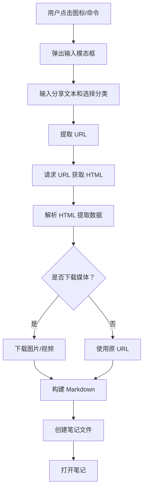

# Xiaohongshu Importer 项目分析报告

## 📋 项目概述

### 基本信息
- **项目名称**: Xiaohongshu Importer (小红书导入器)
- **版本**: 1.1.3
- **作者**: bnchiang96
- **许可证**: MIT
- **项目类型**: Obsidian 插件
- **开发语言**: TypeScript

### 项目简介
Xiaohongshu Importer 是一个 Obsidian 插件，用于将小红书（Xiaohongshu）平台的笔记无缝导入到 Obsidian 知识库中。插件支持提取笔记内容、图片、视频和标签，并将其组织成分类的 Markdown 文件。

### 仓库地址
- GitHub: https://github.com/bnchiang96/xiaohongshu-importer

---

## 🎯 核心功能

### 1. 笔记导入
- 支持通过分享链接或分享文本导入小红书笔记
- 支持多种链接格式：
  - 移动端分享链接：`http://xhslink.com/a/o/...`
  - 桌面端/网页端链接：`https://www.xiaohongshu.com/discovery/item/...`
  - 探索页链接：`https://www.xiaohongshu.com/explore/...`（自动转换为标准格式）

### 2. 内容提取
- **标题提取**: 从 HTML `<title>` 标签中提取
- **内容提取**: 从 HTML 或 JSON 数据中提取笔记描述
- **图片提取**: 从 `window.__INITIAL_STATE__` JSON 数据中提取图片列表
- **视频提取**: 提取 H.264/H.265 格式的视频流 URL
- **标签提取**: 自动识别并提取内容中的标签（#tag 格式）

### 3. 媒体处理
- 支持下载图片和视频到本地存储
- 媒体文件保存在 `<defaultFolder>/media/` 目录


- 用户自定义分类系统
- 默认分类：美食、旅行、娱乐、知识、工作、情感、个人成长、优惠、搞笑、育儿
- 支持"其他"分类
- 可在设置中添加、编辑、删除、重新排序分类

### 5. 文件组织
- 笔记保存结构：`<defaultFolder>/<category>/<noteTitle>.md`
- 视频笔记文件名前缀：`[V]`
- 自动生成 YAML Frontmatter 元数据

---

## 🏗️ 技术架构

### 项目结构
```
xiaohongshu-importer/
├── main.ts              # 主插件文件（593 行）
├── manifest.json        # 插件清单
├── package.json         # NPM 包配置
├── tsconfig.json        # TypeScript 配置
├── esbuild.config.mjs   # 构建配置
├── styles.css           # 样式文件
├── README.md            # 项目文档
├── version-bump.mjs     # 版本管理脚本
└── versions.json        # 版本信息
```

### 技术栈
- **TypeScript**: 主要开发语言
- **ESBuild**: 构建工具
- **Obsidian API**: 插件框架

### 核心类结构

#### 1. `XHSImporterPlugin` (主插件类)
继承自 Obsidian 的 `Plugin` 类，包含以下主要方法：

**生命周期方法**:
- `onload()`: 插件加载，注册 UI 元素和命令
- `onunload()`: 插件卸载（空实现）
- `loadSettings()`: 从存储加载设置
- `saveSettings()`: 保存设置到存储

**UI 相关**:
- `addRibbonIcon()`: 添加侧边栏图标
- `addCommand()`: 注册命令面板命令
- `addSettingTab()`: 注册设置面板

**核心功能方法**:
- `promptForShareText()`: 弹出模态框获取用户输入
- `extractURL()`: 从分享文本中提取 URL
- `importXHSNote()`: 主要导入逻辑
- `extractTitle()`: 提取标题
- `extractImages()`: 提取图片 URL
- `extractVideoUrl()`: 提取视频 URL
- `extractContent()`: 提取内容
- `isVideoNote()`: 判断是否为视频笔记
- `extractTags()`: 提取标签
- `sanitizeFilename()`: 清理文件名
- `downloadMediaFile()`: 下载媒体文件

#### 2. `XHSImporterSettingTab` (设置面板类)
继承自 `PluginSettingTab`，负责：
- 默认文件夹设置
- 媒体下载开关设置
- 分类管理（增删改查、排序）

#### 3. `XHSInputModal` (输入模态框类)
继承自 `Modal`，提供用户界面：
- 分享文本输入框
- 分类选择（芯片按钮）
- 媒体下载选项
- 提交按钮

### 数据流



---

## 📦 核心功能实现细节

### 1. URL 提取逻辑
```typescript
extractURL(shareText: string): string | null {
    // 优先匹配移动端分享链接
    const mobileUrlMatch = shareText.match(/http:\/\/xhslink\.com\/a?o?\/[^\s,，]+/);
    if (mobileUrlMatch) {
        return mobileUrlMatch[0];
    }
    
    // 匹配桌面端/网页端链接
    const webUrlMatch = shareText.match(/https:\/\/www\.xiaohongshu\.com\/(?:discovery\/item|explore)\/[a-zA-Z0-9]+(?:\?[^\s,，]*)?/);
    if (webUrlMatch) {
        // 将 explore URL 标准化为 discovery/item 格式
        return webUrlMatch[0].replace('/explore/', '/discovery/item/');
    }
    
    return null;
}
```

### 2. 数据解析（使用 `__INITIAL_STATE__`）
插件通过解析小红书页面的 `window.__INITIAL_STATE__` JSON 数据获取结构化信息：

```typescript
const stateMatch = html.match(/window\.__INITIAL_STATE__=(.*?)<\/script>/s);
const state = JSON.parse(cleanedJson);
const noteId = Object.keys(state.note.noteDetailMap)[0];
const noteData = state.note.noteDetailMap[noteId].note;
```

### 3. 媒体下载
```typescript
async downloadMediaFile(url: string, folderPath: string, filename: string): Promise<string> {
    const response = await fetch(url);
    const blob = await response.blob();
    const arrayBuffer = await blob.arrayBuffer();
    const filePath = `${folderPath}/${filename}`;
    await this.app.vault.adapter.writeBinary(filePath, arrayBuffer);
    return filename;
}
```

### 4. Markdown 生成
生成的 Markdown 包含：
- YAML Frontmatter（标题、来源、日期、分类等）
- 封面图片/视频
- 笔记内容（移除标签）
- 所有图片
- 标签代码块

---

## ⚙️ 配置选项

### 插件设置
1. **Default Folder** (默认文件夹)
   - 默认值：`"XHS Notes"`
   - 说明：笔记保存的基础文件夹路径

2. **Download Media** (下载媒体)
   - 默认值：`false`
   - 说明：是否默认下载媒体文件到本地

3. **Categories** (分类)
   - 默认值：`["美食", "旅行", "娱乐", "知识", "工作", "情感", "个人成长", "优惠", "搞笑", "育儿"]`
   - 说明：用户自定义的分类列表

### 每次导入时的选项
- 分享文本输入
- 分类选择（芯片式按钮）
- 本次是否下载媒体的开关

---

## 🎨 用户界面

### 1. 侧边栏图标
- 书本图标 📖
- 点击触发导入流程

### 2. 命令面板
- 命令 ID: `import`
- 命令名称：`Import Xiaohongshu note`

### 3. 输入模态框
- 文本输入区（分享文本）
- 分类选择区（芯片按钮）
- 媒体下载开关
- 导入按钮

### 4. 设置面板
- 文件夹配置
- 媒体下载开关
- 分类管理（增删改查、上下移动）

---

## 🔍 代码质量分析

### 优点
1. **类型安全**: 使用 TypeScript，定义了清晰的接口
2. **模块化**: 功能分离清晰，职责单一
3. **错误处理**: 完善的 try-catch 和用户提示
4. **用户体验**: 提供多种导入方式，界面友好
5. **可维护性**: 代码注释清晰，结构合理

### 改进建议
1. **代码复用**: `extractURL` 逻辑在两个地方重复，可以提取为独立函数
2. **测试覆盖**: 缺少单元测试
3. **日志记录**: 错误日志可以更加结构化
4. **性能优化**: 下载多个图片时可以并发处理
5. **配置验证**: 缺少对用户输入的有效验证

---

## 📝 笔记文件格式

### Frontmatter 示例
```yaml
---
title: 我的巴厘岛之旅
source: http://xhslink.com/a/...
date: 2025-04-02
Imported At: 2025-04-02 10:30:45
category: 旅行
---
```

### 内容结构
```markdown
# 标题

  // 或视频标签

笔记正文内容...

```
#标签 1 #标签 2 #标签 3
```


```

---

## 🛠️ 开发环境

### 依赖项
- Node.js
- TypeScript ^5.0.0
- ESBuild ^0.17.0
- Obsidian (最新)

### 构建命令
```bash
# 开发模式
yarn dev

# 生产构建
yarn build

# 版本升级
yarn version
```

### 最低 Obsidian 版本
- 要求：0.15.0+
- 支持移动端：是

---

## 📊 使用场景

### 适用人群
1. **知识管理者**: 收集小红书上的优质内容到个人知识库
2. **研究人员**: 分析小红书内容和趋势
3. **内容创作者**: 整理灵感和素材
4. **Obsidian 用户**: 扩展 Obsidian 的内容来源

### 典型工作流
1. 在小红书 APP 中复制分享链接
2. 在 Obsidian 中点击插件图标
3. 粘贴分享文本，选择分类
4. 选择是否下载媒体
5. 自动导入并打开笔记

---

## 🚀 未来发展方向

### 功能扩展建议
1. **批量导入**: 支持一次性导入多个笔记
2. **定时同步**: 自动检测并导入收藏的笔记
3. **OCR 支持**: 提取图片中的文字
4. **AI 摘要**: 自动生成笔记摘要
5. **标签映射**: 将小红书标签映射到 Obsidian 标签系统
6. **自定义模板**: 允许用户自定义 Markdown 模板

### 技术改进建议
1. **添加单元测试**
2. **实现增量更新**
3. **优化大文件下载**
4. **添加导入历史记录**
5. **支持自定义元数据字段**

---

## 📈 项目评估

### 代码规模
- **主文件**: 593 行 TypeScript 代码
- **复杂度**: 中等
- **可维护性**: 良好

### 功能完整度
- ✅ 笔记导入
- ✅ 内容提取
- ✅ 媒体处理
- ✅ 分类管理
- ✅ 设置界面
- ✅ 错误处理
- ⚠️ 测试覆盖（缺失）
- ⚠️ 文档完善度（良好）

### 用户体验
- 界面简洁直观
- 操作流程清晰
- 错误提示友好
- 配置选项丰富

---

## 📌 总结

Xiaohongshu Importer 是一个功能完善、设计良好的 Obsidian 插件。它成功解决了将小红书内容导入 Obsidian 的需求，提供了丰富的配置选项和良好的用户体验。代码结构清晰，遵循了 Obsidian 插件开发的最佳实践。

**核心优势**:
- 支持多种链接格式
- 完善的媒体处理
- 灵活的分类系统
- 友好的用户界面

**适用场景**: 适合需要将小红书内容整合到个人知识库的 Obsidian 用户。

**推荐指数**: ⭐⭐⭐⭐ (4/5)

---

*报告生成时间：2026-04-22*
*分析工具：Trae IDE + Qwen3.5-Plus*
